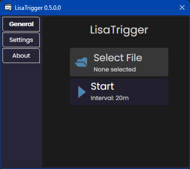
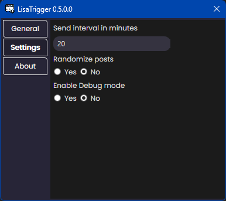

# LisaTrigger

This project is called LisaTrigger. This tool was made for DJLisa to send banners and ascii art to 3DXChat on a continuing basis. For me this was just a fun project to give back to my favorite DJ and her awesome TUNES!!
 

## How to use the Application

Use the "Select file" button to select a csv file (<a id="raw-url" href="https://raw.githubusercontent.com/silentboy3dx/LisaTrigger/master/Example.csv?token=GHSAT0AAAAAAB3NYFPE4ODI3AFBRD5SV7PKY4U4E3A">You can download it here</a> but Its also included in the release zip file)
containing text to post to 3DXChat. After selecting your file press the "Start" button.
Once started the Application will send post texts from your to file to where ever your cursor is.

## Settings

The settings for the Application are pretty much self explanatory but lets get over them for the sake of clarity.
This is how the settings screen look like.

****Note*** Settings can be changed even while the Application has started positing, but be aware of the fact that changing the settings will reset the countdown timer.*

| 	Wording                  | Type	   | 	Meaning                                                           |
|:--------------------------|:--------|:-------------------------------------------------------------------|	
| Send interval in minutes  | 	Number | This is the period of time in between sending texts.	              |  
| Randomize posts           | 	Yes/No | Post text from the posts file in random order.	                    |  
| Enable Debug mode         | 	Yes/No | If selected yes a debug dialog will open showning sending history. |  

## The author

My name is Silentboy. You might know me from the Sin club (say hi). Of course, this is not my real name but I don't want to reveal my real name here since not everyone in Sin likes me (Shoutout to Clittywinks). Just say hi when you see me if you will use the plugin and I will be happy (it's free after all).

PS: Happy hump day.